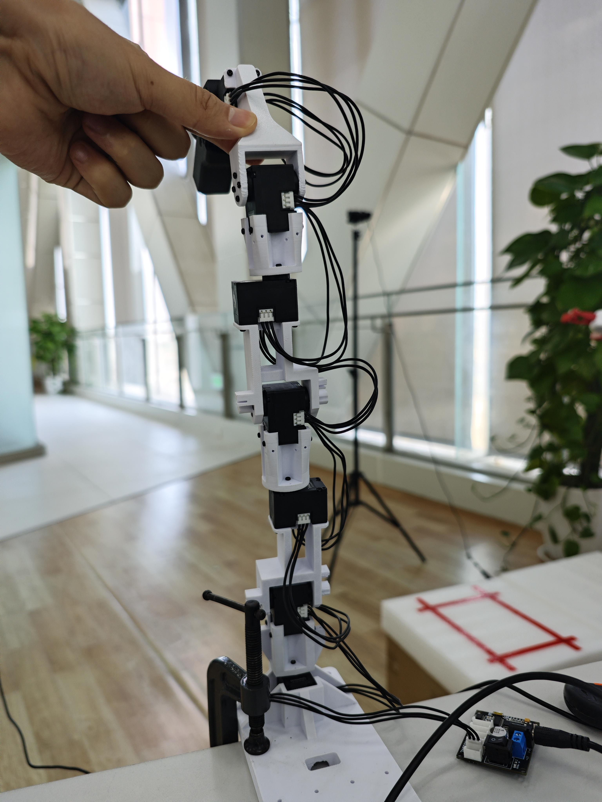
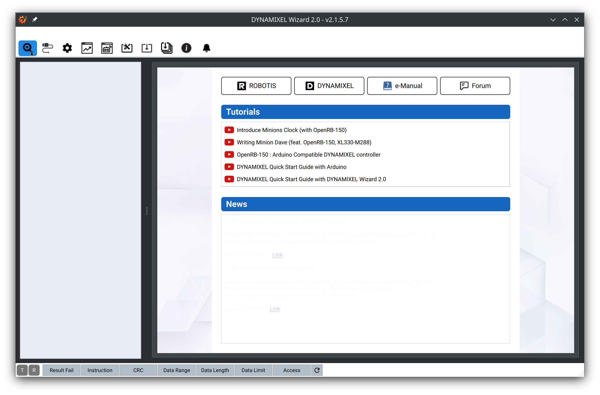
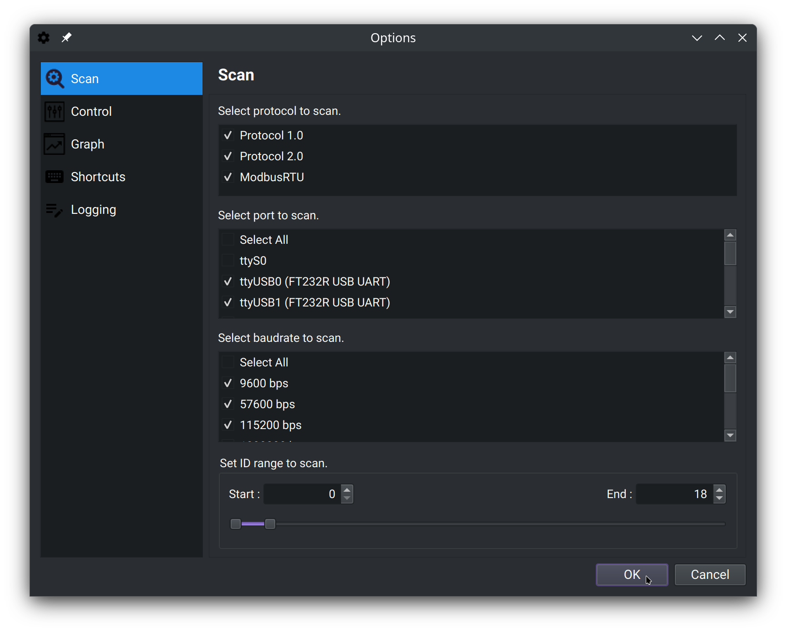
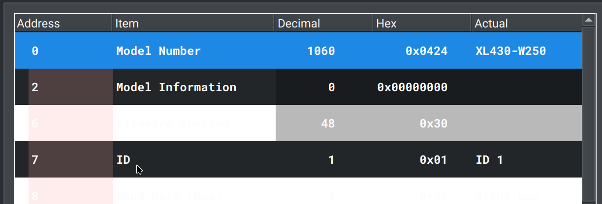
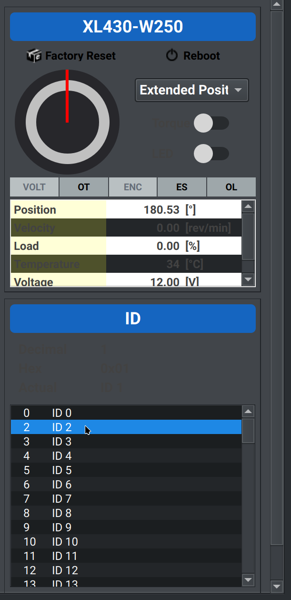
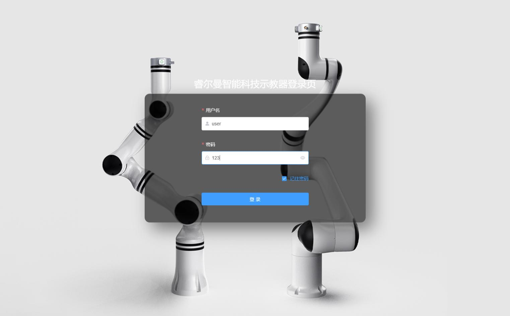
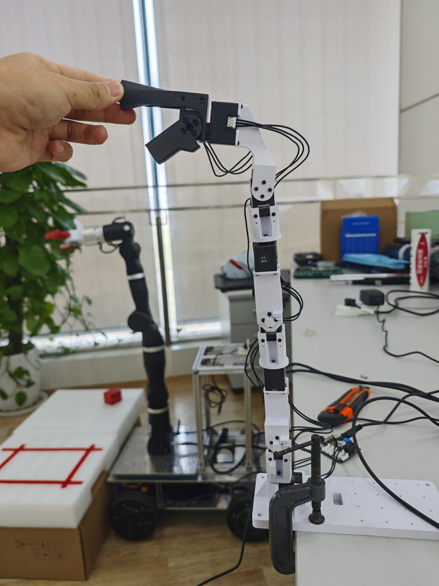
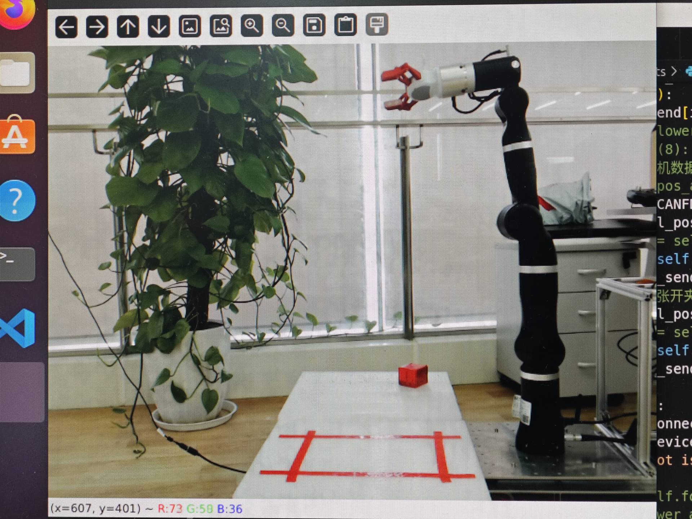

# Quick Start

## Installation

以下操作请在Linux环境下进行，推荐`Ubuntu 20.04`及以上，`CentOS 8`及以上，`openEuler 22.03 LTS`及以上或`Arch Linux`等，内核版本大于等于`5.5`，可通过```uname -a```命令查看系统内核版本。

将本仓库克隆到本地，```cd```到所克隆的仓库目录并安装依赖，在此之前请确保系统中已安装miniconda或者anaconda并激活环境：

```bash
conda create -n lerobot python=3.10
pip install mujoco opencv-python dynamixel_sdk
pip install ffmpeg
pip install '.[aloha]'
```
ffmpeg安装需使用ffmpeg官方指导教程

## Hardware Setup

### 硬件采购

请组装好机器人。在默认配置中，主动臂为Koch机器人，从臂为RML-gen72,其硬件配置如下：

- 主动臂：有七个关节，以及一个夹爪。每个关节可驱动一个Dynamixel XL330-288舵机，夹爪部分驱动Dynamixel XL330-077舵机，接5V电源。
    - 硬件需求：
        - 舵机：7个Dynamixel XL330-M288舵机，1个Dynamixel XL330-M077每个舵机之间首尾相连，其中有一根电源线接5V电源。
        - 电源：电源线，5V电源或其适配器。
        - 其他：控制主机、导线、3D打印机械臂等

- 从动臂：RML-gen72七轴机械臂以及乐白LMG-90夹爪
        

以下为参考图：
- 主臂：


- 从臂：


组装视频：https://www.bilibili.com/video/BV1pevKeqEsT
组装视频为五轴机械臂，可做参考。电机初始化步骤相同

要保证机器人能够正常工作，请确保电源线、舵机、机械臂、控制主机、导线、机械臂等各个部件的装配与连接正确无误。

### ID配置

下载```DYNAMIXEL Wizard```软件，[下载链接在此处](https://emanual.robotis.com/docs/en/software/dynamixel/dynamixel_wizard2/)，**将一个舵机单独直接连上板子**，请注意**一次只连一个**，且**注意连接5V**，接上主机。

```DYNAMIXEL Wizard```软件安装后打开：



点击图左上方齿轮图标，设置扫描参数如下：



点击图左上方的放大镜图标进行扫描：


根据接入顺序，可能是`/dev/ttyUSB0`或`/dev/ttyUSB1`，若扫描到结果如上图即成功。此窗口会自动关闭。

点击中间如图所示：



点击右侧栏ID选项，可设置ID。



向下滑动滚轮，可看到`Save`，保存即可。

依次操作，将两个机械臂分别进行1到6编号。

最后两个机械臂接上，扫描一下：


若得到如图所示效果，则配置成功。

## Configuration

请在```lerobot/common/robot_devices/robots/factory.py```与```lerobot/common/robot_devices/robots/koch.py```文件中配置机器人参数。

### 机器人硬件参数配置

请在[```lerobot/common/robot_devices/robots/factory.py```](../lerobot/common/robot_devices/robots/factory.py)文件中配置主动臂机器人硬件参数：

```python
 robot = KochRobot
            leader_arms={
                "main": DynamixelMotorsBus(
                    port="/dev/ttyUSB0",
                    motors={
                        # name: (index, model)
                        "shoulder_pan": (1, "xl330-m288"),
                        "shoulder_lift": (2, "xl330-m288"),
                        "elbow_flex": (3, "xl330-m288"),
                        "wrist_flex": (4, "xl330-m288"),
                        "wrist_roll": (5, "xl330-m288"),
                        "wrist_1": (6, "xl330-m288"),
                        "weist_2": (7, "xl330-m288"),
                        "gripper": (8, "xl330-m077"),
                    },
                ),
            },
            cameras={
                "top": OpenCVCamera(2, fps=30, width=640, height=480),
                "phone": OpenCVCamera(4, fps=30, width=640, height=480),
            },
```

其中：
- ```leader_arms```参数为主动臂参数
- ```port```参数为串口号，指代的是Linux下USB串口设备文件，如```/dev/ttyUSB0```。
    运行程序前请确保串口设备文件存在，否则可能导致程序无法正常运行，并运行```sudo chmod 666 /dev/ttyUSB0```命令赋予串口设备文件权限。
- ```motors```参数为机械臂的索引号和型号，如```(1, "xl330-m288")```。
    第一个数为索引号，第二个数为机械臂型号，请根据实际情况填写，如有机械臂型号不同，请务必对应进行修改。
- ```cameras```参数为相机的索引号和参数，可更改其帧率与分辨率，建议其配置至少在代码此处所给出的默认配置，勿自行降低。

## 机器人串口通讯配置

请在[```lerobot/common/robot_devices/motors/dynamixel.py```](../lerobot/common/robot_devices/motors/dynamixel.py)文件中进行配置。

此处只需配置波特率，代码如下：

```python
BAUD_RATE = 57600
```

默认为`57600`，请根据实际情况进行修改。

## 从臂gen72连接和测试

请使用以太网线连接机械臂控制器和电脑，将以太网口的IPV4配置为192.169.1.10。打开浏览器，若使用有线连接，则网址输入 192.168.1.18 进入登录页。若可进入登录界面，则连接正常。



## Running the Demo

请运行control_robot.py进行测试：

```bash
python lerobot/scripts/control_robot.py teleoperate --fps 30
```

其中```teleoperate```为控制模式，```--fps```为帧率，可根据机器人性能调整。
在首次启动之际，请将主动臂恢复至初始零位姿态，轻按两次回车键，便会生成.cache文件。而在每一次代码运行之前，需将主动臂归为零位，确保操作过程中速率适中。

零位姿态如图所示：


运行成功后，控制台将滚动输出，如图所示：


操控主动臂，可看到从动臂也跟着调整姿态。

倘若此处遇到问题，请仔细审查前面步骤是否正确完成与配置。

## Recording Dataset

请确认是否正确连接摄像头，并采用OpenCV自行调用摄像头进行测试。[这里有一个脚本](../lerobot/scripts/test_opencv.py)，可自行编辑后```python lerobot/scripts/test_opencv.py```调取画面；并调整角度，清理摄像头所拍到的视野无遮挡物，并能够清晰的记录下从动臂的完整动作。查看相机ID号，若相机ID号与(../lerobot/common/robot_devices/robots/factory.py)中的相机ID不匹配，在factory.py中修改相机ID号。

参考拍摄角度如图所示：



若摄像头连接正确，则可进行数据集录制。

数据集若过大则可能出现程序闪退，从而导致此前的录制数据丢失，所以请注意控制数据集大小或选择运行内存更大的电脑（推荐32G及以上）。

您也可登录注册`huggingface`账户，并进行`huggingface-cli login`登录，配置具有读写权限的API KEY，然后运行以下命令进行数据集录制：
录制的数据集将保存在当前文件夹下的data/$USER/koch_pick_place_lego。

```python
python lerobot/scripts/control_robot.py record_dataset \
    --fps 30 \
    --root data \
    --repo-id $USER/koch_pick_place_lego \
    --num-episodes 100 \
    --run-compute-stats 1 \
    --warmup-time-s 2 \
    --episode-time-s 20 \
    --reset-time-s 10
```

- ```fps```参数用于控制录制频率。
- ```root``` 参数指定保存路径为当前目录下的 data 文件夹。
- ```repo-id```参数指定保存路径为 data/$USER/koch_pick_place_lego，其中 $USER 需要替换为你的 Hugging Face 用户名。
- ```num-episodes``` 参数设置录制的回合数，这里表示需要录制 100 次动作。
- ```warmup-time-s```参数设置启动时的代码休眠时间，启动后有 2 秒的时间供使用者调整设备。
- ```episode-time-s``` 参数设置每回合的录制时间，使用者需要在 20 秒内完成数据的录制。
- ```reset-time-s```参数设置每回合录制完成后的休眠时间，在这段时间内，操作者可以调整设备、重新放置被抓取物，并稍作休息。


在录制过程中，利用左键操作能够重新捕捉当前轮次的数据，而右键的使用则允许您跳过当前的录制步骤。请注意，动臂设计时考虑到了关节限位，因此在操作时请避免大幅度移动，以免超出安全范围。为了确保录制数据的质量与有效性，请在整个过程中维持平稳、适中的速度。这样不仅能够提高数据的准确性，还能有效避免潜在的操作风险。

在“reset-time-s”阶段，主动臂无法对从动臂进行控制。在此情形下，可以将被抓取物的位置还原，为下一次抓取做好准备。不过，切勿大幅度移动主动臂。一旦主动臂关节与从动臂关节之间的角度差值超过 10 度，就会致使控制出现异常状况。
录制的数据集将保存在当前文件夹下的data/$USER/koch_pick_place_lego路径下，$USER为您的huggingface账户名。

## Training

请确保你拥有一台显存18GB及以上显卡、至少32GB的运行内存与至少16核心处理器的x86_64架构计算机，将您的lerobot整体打包备份过去，使用相同的方式进行环境配置，并保证您已登陆huggingface账户并配置好API KEY。

运行Training脚本：

```bash
DATA_DIR=data python lerobot/scripts/train.py \
    policy=act_koch_real \
    env=koch_real \
    dataset_repo_id=$USER/koch_pick_place_lego \
    hydra.run.dir=outputs/train/act_koch_real
```


## Running
使用训练的模型进行推理:
```bash
    python lerobot/scripts/control_robot.py run_policy -p outputs/train/act_koch_real/checkpoints/080000/pretrained_model
```
在使用模型进行推理分析时，务必确保摄像头捕捉的视角与原始录制数据的视角保持一致，以提高推理精度
